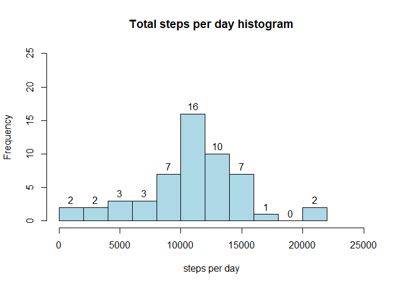
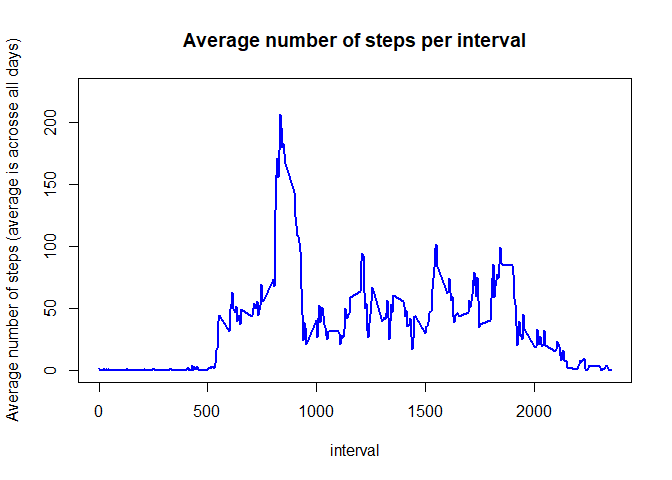
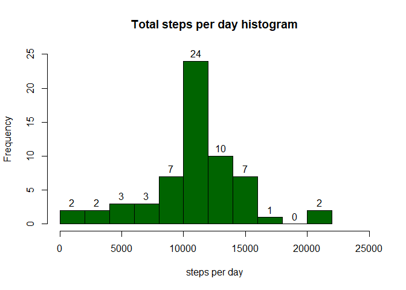
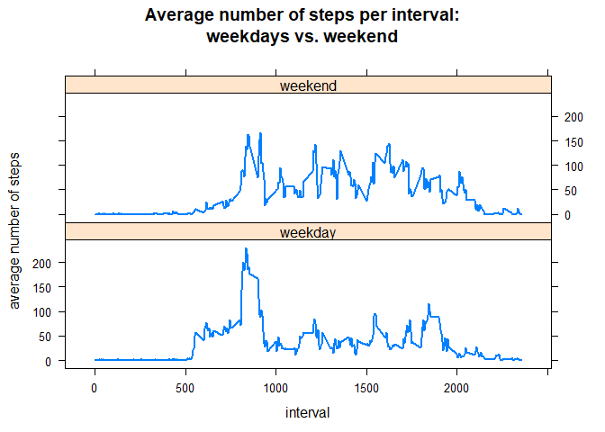

This assignment makes use of data from a personal activity monitoring device. This device collects data at 5 minute intervals through out the day. The data consists of two months of data from an anonymous individual collected during the months of October and November, 2012 and include the number of steps taken in 5 minute intervals each day.  
The variables included in this dataset are:  
- **steps**: Number of steps taking in a 5-minute interval (missing values are coded as NA)  
- **date**: The date on which the measurement was taken in YYYY-MM-DD format.  
- **interval**: Identifier for the 5-minute interval in which measurement was taken.  
The dataset is stored in a comma-separated-value (CSV) file and there are a total of 17,568 observations in this dataset.

## Loading and preprocessing the data  


Loading the data from the csv file to a data frame:   

```r
unzip("activity.zip")
activity_data<-read.csv("activity.csv",header=TRUE)
```

Here is a snapshot of the activity data set:  

```r
library(xtable)
knitr::kable(activity_data[5000:5006,],row.names=FALSE,align=c("c","c","c"),caption="Activity Data set snapshot:")
```


Table: Activity Data set snapshot:

 steps       date       interval 
-------  ------------  ----------
  757     2012-10-18      835    
  608     2012-10-18      840    
  568     2012-10-18      845    
  571     2012-10-18      850    
  355     2012-10-18      855    
  55      2012-10-18      900    
  32      2012-10-18      905    

## What is mean total number of steps taken per day?
For this part of the assignment, we ignore the missing values in the dataset.  
Calculating the total number of steps taken per day:

```r
sum_steps_per_day<-tapply(activity_data$steps,activity_data$date,sum)
hist(sum_steps_per_day,col="lightblue",xlab = "steps per day",main = "Total steps per day histogram",
     breaks = 10,xlim=c(0,25000),ylim=c(0,25),labels = T)
```

<!-- -->
  
### Calculating the mean and median of Total steps per day:  

```r
mean_steps_per_day<-round(mean(sum_steps_per_day,na.rm = T))
median_steps_per_day<-round(median(sum_steps_per_day,na.rm = T))
```
#### Mean of total steps per day:   10766  
#### Median of total steps per day: 10765  

## What is the average daily activity pattern?
The bellow plot is showing on X axis - the "5 minutes interval identifier", and on the y axis - the average number of steps taken across all days for that interval.


```r
mean_steps_per_interval<-tapply(activity_data$steps,activity_data$interval,mean,na.rm=TRUE)
plot(x=names(mean_steps_per_interval),y=mean_steps_per_interval,type="l",lwd=2,ylim=c(0,max(mean_steps_per_interval)+20),
     col="blue",main="Average number of steps per interval",xlab="interval",ylab="Average number of steps (average is acrosse all days)")
```

<!-- -->

```r
# maximum number of steps:
max_val<-max(mean_steps_per_interval)
# which interval is it:
max_int<-names(which.max(mean_steps_per_interval))
```

#### Interval containing maximum number of average steps per day: 835.     
#### This maximum number of steps per day is: 206.  

## Imputing missing values
Calculating the total number of missing values in the dataset (i.e. the total number of rows with NA):  

```r
for (j in 1:dim(activity_data)[1]) {
        activity_data$isna[j]<-any(is.na(activity_data[j,1:3]))
}
sum_na_rows<-sum(activity_data$isna)
```
Total number of rows with NA: 2304.  

Setting the NA values to be the average of all days on same 5 min interval:  

```r
# first add a column to the activity_data - that contains the mean steps per that interval (calculated before):
activity_data$mean_steps_per_int<-mean_steps_per_interval[as.character(activity_data$interval)]
# now add a new columns that will contain the original steps column, unless it is "NA" - then it will contain the value in above column:
activity_data$steps_new<-ifelse(activity_data$isna,activity_data$mean_steps_per_int,activity_data$steps)
```

Creating a new dataset that is equal to the original dataset but with the missing data filled in:  

```r
activity_data2<-data.frame("steps"=activity_data$steps_new,
                           "date"=activity_data$date,
                           "interval"=activity_data$interval)
```

Calculating the total number of steps taken per day (now with new data set that has no NA in it):  

```r
sum_steps_per_day2<-tapply(activity_data2$steps,activity_data2$date,sum)
hist(sum_steps_per_day2,
     col="darkgreen",xlab = "steps per day",main = "Total steps per day histogram",
     breaks = 10,xlim=c(0,25000),ylim=c(0,25),labels = T)
```

<!-- -->

### Calculating the mean and median of Total steps per day:  

```r
mean_steps_per_day2<-round(mean(sum_steps_per_day2))
median_steps_per_day2<-round(median(sum_steps_per_day2))
```
#### Mean of total steps per day:   10766  
#### Median of total steps per day: 10766  

We can see that the mean and median are minorly affected by imputing the data. 

## Are there differences in activity patterns between weekdays and weekends?

Adding a new factor variable in the dataset with two levels – “weekday” and “weekend”, indicating whether a given date is a weekday or weekend day:  

```r
activity_data2$weekpart<-as.factor(ifelse(weekdays(as.Date(activity_data2$date)) %in% c("Sunday","Saturday"), "weekend", "weekday"))
```
Plotting the time series of the 5-minute interval (x-axis) and the average number of steps taken, averaged across all weekday days or weekend days (y-axis):  

```r
# subsetting the data set for weekends and weekdays separately:
activity_weekdays<-subset(activity_data2,activity_data2$weekpart=="weekday")
activity_weekends<-subset(activity_data2,activity_data2$weekpart=="weekend")
mean_steps_per_interval_weekend<-tapply(activity_weekends$steps,activity_weekends$interval,mean)
mean_steps_per_interval_weekday<-tapply(activity_weekdays$steps,activity_weekdays$interval,mean)
# build the common data set of mean per interval:
activity_means<-data.frame("interval"=c(names(mean_steps_per_interval_weekday),names(mean_steps_per_interval_weekend)),
                           "mean_steps"=c(mean_steps_per_interval_weekday,mean_steps_per_interval_weekend),
                           "weekpart"=rep(c("weekday","weekend"),each=dim(mean_steps_per_interval_weekday)))
activity_means$interval<-as.character(activity_means$interval)
activity_means$interval<-as.numeric(activity_means$interval)
library(lattice)
xyplot(mean_steps ~ interval | weekpart, data=activity_means, layout=c(1,2),type="l",ylab = "average number of steps",
       main="Average number of steps per interval:\nweekdays vs. weekend",lwd=2)
```

<!-- -->
